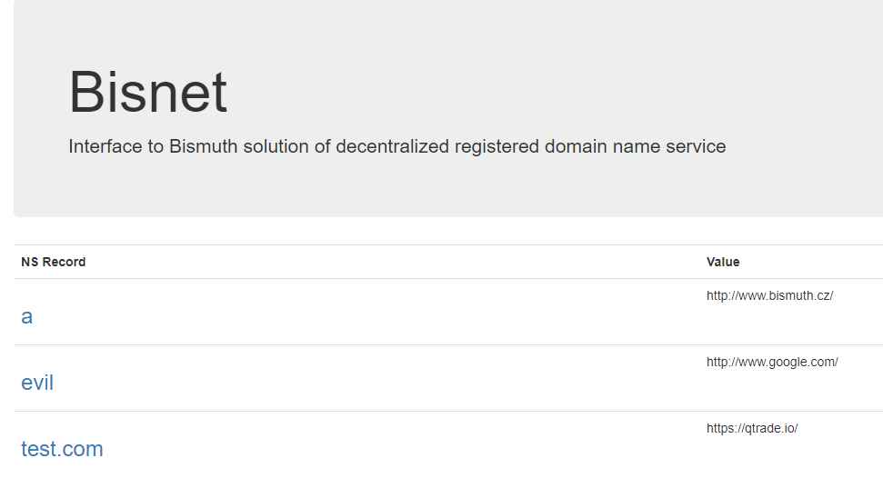

# Welcome to bisnet

To register your **bisnet** entry, you need to send a transaction to the Bismuth network with the following properties:

* **operation:** domain
* **data:** name:value

Example:

* **operation:** domain
* **data:** mybestdomain.com:http://www.google.com

By running **bisnet.py**, you can check for the current existing entries at [http://127.0.0.1:4682](http://127.0.0.1:4682)

You need to adjust path to your ledger in _config.txt_ and your node must be running.

There are currently no DNS services integrating **bisnet** that we are aware of.

